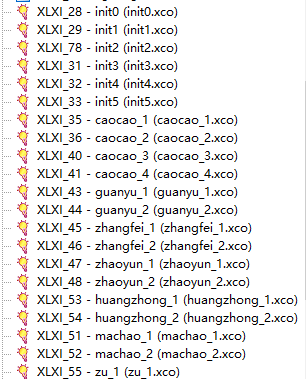
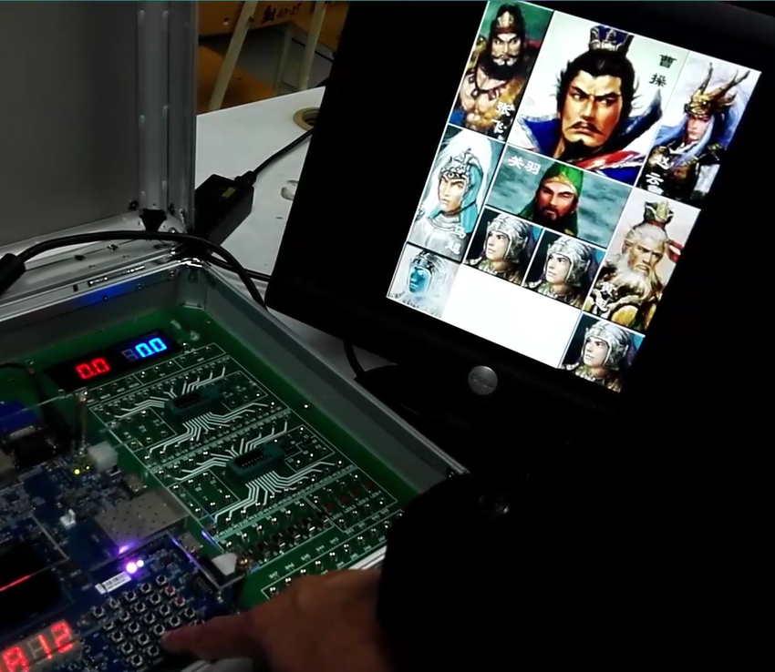

# 1. OVERVIEW
*Klotski*, as its name reveals, is a **platform** for traditional game **Klotki** in **Chinese** version,
namely **Huangrongdao**.
As a homework assigned in the **digital logic design** course for sophomore majoring in CS,
it is an **individual project** for **non-comercial** purposes.
This system allows you to play Klotski with several given beginnings on Xilinx FPGA, like what is illustrated as follows:  

  

# 2. FUNCTIONS
The platform is designed to contain all these following functions:  
  

# 3. ARCHITECTURE
The overall sketch of the architecture can been described as follows:
  

# 4. USAGE
Make sure that the consistence of relative paths among all the folders.
## The hierarchy of the file:
- images: images for Readme
- coe: files to initial RAM and ROM on FPGA
- ngc: IP-cores for certain modules
- sch: schemes for certain modules
- sym: files that record the symbolic features of elements
- ucf: physical constrain
- v: codes for certain modules

## How to build
First create an empty ISE project, and then include all the sym files. Next start with the file Framework.sch.  
Here is the sample hierarchy:  
  
  
  

## Interfaces
- First one must get familiar with the interfaces:  
Interfaces on board for players:  
  
  
Interfaces on board for developers:  
  
Interfaces on screen for both players and developers:  
  

## Sample game
1. Use SW[3:1] to select a beginning, press rst for a while to start.
  
2. In order to traverse the chessmen in the board, press C for forward traversal and E for backward until 
you select the expected one. The selected chessman will be higtlighted.
In the sample, the soldier at the bottom left corner is selected and to be moved.  
  
3. In order to move the selected chessman, press 5, A, D and 8 for moving up, right, down and left respectively.  
In the sample, the soldier seleced has been moved to the right by 1 step.  
  
4. One don't manage to finish the game until he has move the 2\*2 chessman, namely Caocao, to the very bottom of the board.  
Like this:  
  
5. When game is over, there will be a prompt "You win!" displaying, as well as the number of steps the user has taken.  
  
  
# 5. LICENSE
The content of all the codes are supposed to use a licence [AGPLv3](./LICENSE)  

# 6. HOW TO CONTRIBUTE
1. Learn what is a AGPLv3, if you have not yet done so (see details above).  
2.  Create your change to the repo in question.
- Fork the desired repo, develop and test your code changes.
- Ensure that your code is clear and comprehensible.
- Ensure that your code has an appropriate set of unit tests which all pass.
3. Submit a pull request.
4. The repo owner will review your request. If it is approved, the change will be merged. If it needs additional work, the repo owner will respond with useful comments.

# 7. CREDIT
First of all, I would like to extend my sincere gratitude to my supervisor, Qingsong Shi, for his instructive advice and useful 
suggestions on my learning on digital logic design.   
I am also deeply grateful of Qingsheng Xiao, the TA's help in the completion and assessment of this project.  
High tribute shall be paid to Jinhong Li and Jiang Wu, whose profound knowledge of Xilinx ISE and Verilog HDL triggers 
my inspiration for this brilliant project.  
Also thankful to my ex-girlfriend Muyun Huang, for her understanding and support to me during the whole project session.

